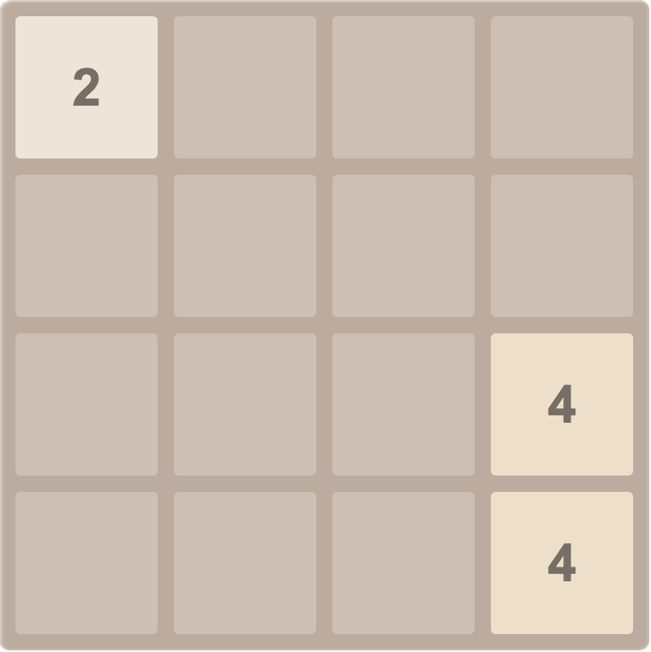
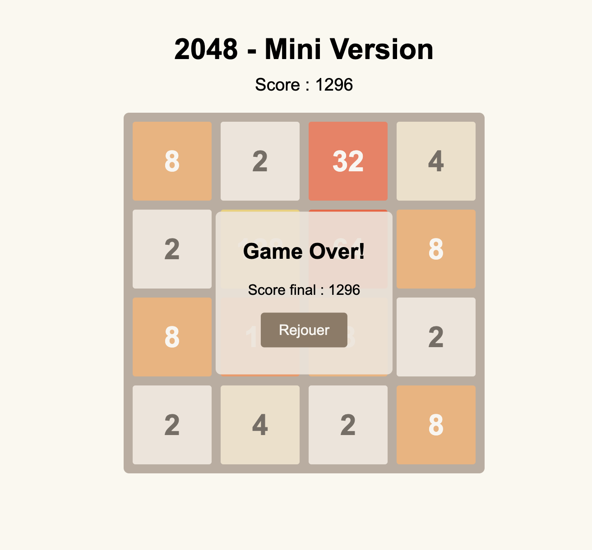

Clone simplifié du jeu **2048**, réalisé en **HTML/CSS/JS** sans framework, parfait pour comprendre les bases de la manipulation du DOM et de la logique de fusion des tuiles.

## Fonctionnalités
- Grille 4x4.
- Déplacement avec les flèches du clavier (←, ↑, →, ↓).
- Fusion automatique des tuiles de même valeur (2+2=4, 4+4=8, ...).
- Génération d’une nouvelle tuile après chaque mouvement.
- Score augmenté par la valeur de fusion.

## Installation & Lancement
1. **Cloner** ce dépôt ou télécharger les fichiers.
2. **Ouvrir** `index.html` dans un navigateur (ou via un petit serveur local).
3. **Jouer** avec les touches fléchées pour déplacer les tuiles.

## Compétences acquises
- **Manipulation du DOM** : création, mise à jour et suppression d’éléments (pour l’affichage des tuiles).
- **Gestion des événements clavier** : écoute et réaction aux touches fléchées.
- **Logique de fusion** : algorithmes de tri, filtrage des 0, fusion conditionnelle.
- **Utilisation de structures de données** (tableaux 2D).
- **Gestion d’un score** et affichage en temps réel.

## Améliorations possibles
- Animation plus fluide des fusions/déplacements.
- Message de victoire spécifique à la tuile 2048.
- Meilleur design (couleurs, UI, etc.).

